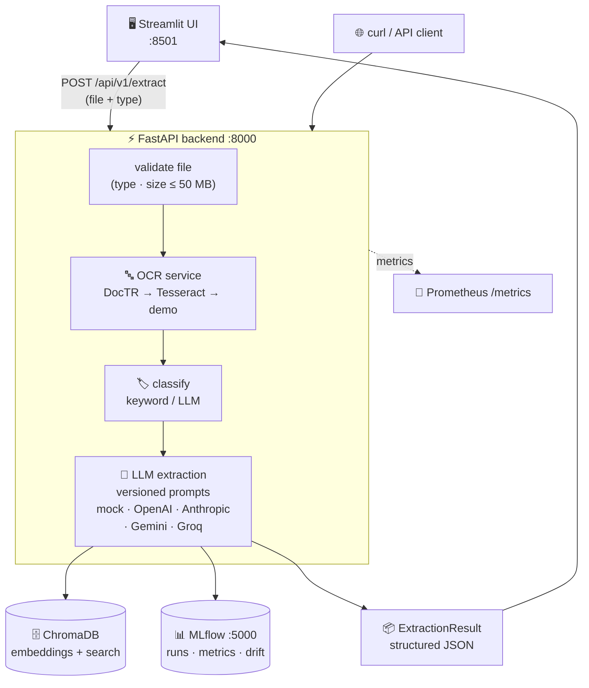

# DocAI — AI Document Intelligence Platform 📄→🧠→`{ }`

**Turn scanned invoices, contracts, and reports into clean, structured JSON** — through a production-grade pipeline of OCR → LLM extraction → vector search, with full MLOps (experiment tracking, drift detection, prompt A/B testing) and observability baked in.

[](https://github.com/TarunReddy8/Doc-AI-Flow/actions/workflows/ci.yml)


> **▶️ Runs with zero API keys.** A built-in `mock` mode drives the *entire* pipeline — OCR, classification, extraction, vector storage, MLflow logging — so you can `git clone` and see it work in one command. Add an OpenAI / Anthropic / Gemini / Groq key when you want real LLM extraction.

---

## ✨ Highlights

- **📤 One endpoint, structured data out** — upload an invoice/contract image or PDF; get validated JSON (fields, line items, totals) back in milliseconds.
- **🔍 OCR with graceful fallback** — DocTR (deep-learning) → Tesseract → demo text, keeping whichever scores highest, so it never hard-fails.
- **🧠 Versioned prompt registry** — `invoice_v1`, `invoice_v2` (chain-of-thought), `contract_v1`… every prompt is versioned and **A/B-testable** from the API.
- **🗄️ Semantic search** — every processed document is embedded into **ChromaDB**; query past documents by meaning, not keywords.
- **📊 Real MLOps** — **MLflow** logs every extraction as a reproducible run; built-in **drift detection** and **prompt-comparison** endpoints turn quality into data.
- **📡 Observability** — **Prometheus** metrics for latency, confidence, field counts, and errors, exposed at `/metrics`.
- **🖥️ Streamlit dashboard** — upload, search, and monitor drift/A-B from a UI, with a live backend health panel.
- **🐳 One-command deploy** — `docker-compose up` brings up API + MLflow + Prometheus + Grafana. **22 unit tests**, CI/CD on every push.

---

## 🏗️ Architecture



**The flow:** a document is validated → OCR'd (with fallback) → classified → extracted by a versioned LLM prompt → the result is stored for semantic search (ChromaDB), logged as an experiment (MLflow), and returned as strict Pydantic-validated JSON. Every stage emits Prometheus metrics.

---

## 🚀 Quickstart

**No API key needed** — the default `mock` mode runs the whole pipeline.

```bash
git clone https://github.com/TarunReddy8/Doc-AI-Flow.git && cd Doc-AI-Flow
pip install -r requirements.txt
cp .env.example .env               # defaults to LLM_PROVIDER=mock
python data/generate_samples.py    # creates sample invoice + contract images
bash start.sh                      # launches API + MLflow + Streamlit
```

Then open:

| Interface | URL |
|---|---|
| 🖥️ Streamlit dashboard | http://localhost:8501 |
| 📘 Swagger API docs | http://localhost:8000/docs |
| 📊 MLflow experiments | http://localhost:5000 |
| 📡 Prometheus metrics | http://localhost:8000/metrics |

**Or with Docker** (adds Prometheus :9090 + Grafana :3000):

```bash
docker-compose up --build
```

<details>
<summary><b>Run the services manually (3 terminals)</b></summary>

```bash
# 1 — FastAPI backend
uvicorn app.main:app --host 0.0.0.0 --port 8000

# 2 — MLflow tracking server
mlflow server --host 0.0.0.0 --port 5000 \
  --backend-store-uri sqlite:///data/mlflow.db \
  --default-artifact-root ./data/mlflow_artifacts

# 3 — Streamlit frontend
streamlit run frontend/app.py --server.port 8501
```
</details>

---

## 🧠 LLM providers

Set `LLM_PROVIDER` in `.env` — the pipeline is provider-agnostic:

| Provider | `LLM_PROVIDER` | Key |
|---|---|---|
| **Mock** (default) | `mock` | *none — realistic synthetic extraction* |
| OpenAI | `openai` | `OPENAI_API_KEY` |
| Anthropic | `anthropic` | `ANTHROPIC_API_KEY` |
| Google Gemini | `gemini` | `GEMINI_API_KEY` |
| Groq | `groq` | `GROQ_API_KEY` |

```env
LLM_PROVIDER=openai
OPENAI_API_KEY=sk-your-key-here
```

---

## 🛠️ Tech stack

| Layer | Technology | Role |
|---|---|---|
| API | **FastAPI + Uvicorn** | Async HTTP, auto Swagger docs |
| OCR | **DocTR / Tesseract** | Image/PDF → text, with fallback |
| Extraction | **LangChain** + OpenAI / Anthropic / Gemini / Groq | Versioned-prompt field extraction |
| Offline mode | Built-in **mock extractor** | Full pipeline, no API key |
| Vector store | **ChromaDB** (PersistentClient) | Embeddings + semantic search |
| Experiment tracking | **MLflow** | Runs, metrics, drift, A/B compare |
| Monitoring | **Prometheus** | Latency, confidence, error metrics |
| Frontend | **Streamlit** | Upload / search / monitoring UI |
| Validation | **Pydantic v2** | Strict request/response schemas |
| Logging | **structlog** | Structured JSON logs |
| Deploy | **Docker Compose** | One-command full stack |

---

## 🔬 How the pipeline works

At a glance, a request flows through **config → OCR → classify → extract → store & track → respond**, all strictly typed and observable. Each stage is a small, single-responsibility service in `app/services/`.

<details>
<summary><b>📖 Full stage-by-stage deep dive (click to expand)</b></summary>

### 1 — Configuration (`app/core/config.py`)
On startup, `pydantic-settings` reads `.env` into a typed `Settings` singleton (cached with `@lru_cache`): OCR engine, LLM provider, ChromaDB path, MLflow URI, max file size, confidence thresholds.

### 2 — Application startup (`app/main.py`)
FastAPI boots via an `asynccontextmanager` lifespan handler. `setup_logging()` configures `structlog`; the `APP_INFO` Prometheus gauge captures the active engine/LLM; CORS is enabled; `/metrics` is mounted as a sub-app; business routes live under `/api/v1`.

### 3 — Document upload (`POST /api/v1/extract`)
Accepts `multipart/form-data`: `file` (PDF/PNG/JPG/TIFF/BMP/WebP ≤ 50 MB), `document_type`, `store_in_vectordb`, and an optional `prompt_version` for A/B tests. A UUID `document_id` is minted and the `ACTIVE_EXTRACTIONS` gauge incremented.

### 4 — OCR extraction (`app/services/ocr_service.py`)
Tries **DocTR** (CRNN deep-learning OCR), falls back to **Tesseract** (per-word confidence averaged) if below `OCR_CONFIDENCE_THRESHOLD` (0.7), and keeps the higher-confidence result. If no engine is installed, a demo-text fallback keeps the pipeline runnable. Returns an `OCRResult` (`raw_text`, `confidence`, `engine_used`, `page_count`, `processing_time_ms`).

### 5 — Classification (`extraction_service.classify_document`)
For `document_type=unknown`: mock mode keyword-matches ("invoice", "agreement"…); real mode runs the `classify_v1` prompt through LangChain on the first 500 chars and parses a single-word `DocumentType`.

### 6 — LLM structured extraction (`extraction_service.py` + `mock_extraction.py`)
The heart of the system. `PROMPT_REGISTRY` holds versioned prompts (`invoice_v1`, `invoice_v2` chain-of-thought, `contract_v1`, `classify_v1`); `_select_prompt()` picks the newest or an A/B override. **Mock mode** synthesizes realistic data from pools; **real mode** invokes the configured provider, parses JSON (stripping code fences), and computes a heuristic confidence weighted 70% on critical fields (number, vendor, total) / 30% on the rest.

### 7 — Vector storage (`app/services/vector_service.py`)
A `chromadb.PersistentClient` upserts each document (UUID + OCR text + rich metadata) into the `docai_documents` collection (cosine space), powering `GET /api/v1/search`.

### 8 — Experiment tracking (`app/services/mlflow_service.py`)
Every run logs params (doc id/type, prompt version, OCR engine, model), metrics (OCR & extraction confidence, fields extracted, completeness, latency), and tags to the `docai-extraction` experiment. `check_drift()` compares recent vs. baseline mean confidence (flags if Δ > 0.05); `get_prompt_comparison()` aggregates per prompt version for A/B decisions. The `run_id` is returned so you can deep-link into the MLflow UI.

### 9 — Prometheus metrics (`monitoring/metrics.py`)
`docai_requests_total`, `docai_request_duration_seconds`, `docai_ocr_confidence`, `docai_extraction_confidence`, `docai_fields_extracted`, `docai_extraction_errors_total`, `docai_active_extractions`, `docai_app` — all at `GET /metrics`.

### 10 — API response
Returns a Pydantic `ExtractionResult`: `document_id`, `status`, `document_type`, `ocr_result`, `extracted_data`, `confidence_score`, `prompt_version`, `mlflow_run_id`, `processing_time_ms`, `warnings[]`.

### 11 — Streamlit frontend (`frontend/app.py`)
Three tabs — **Extract** (upload → JSON + confidence + MLflow link), **Semantic Search** (cosine-ranked matches), **Monitoring** (drift + prompt A/B) — plus a live sidebar health check.

### 12 — Offline evaluation (`ml/pipelines/evaluation.py`)
`run_evaluation()` scores extractions against hardcoded ground-truth samples with field-level accuracy (exact match for text, float tolerance for numbers, count for arrays) — a regression guard you can run in CI before shipping a prompt change.

</details>

---

## 📡 API reference

| Endpoint | Purpose |
|---|---|
| `POST /api/v1/extract` | Upload a document → structured JSON (`document_type`, `store_in_vectordb`, `prompt_version`) |
| `GET /api/v1/search?query=…` | Semantic search across processed documents |
| `GET /api/v1/health` | Health of OCR / LLM / ChromaDB / MLflow |
| `GET /api/v1/monitoring/drift` | Extraction-quality drift vs. historical baseline |
| `GET /api/v1/prompts/compare` | Prompt-version performance for A/B decisions |

```bash
curl -X POST http://localhost:8000/api/v1/extract \
  -F "file=@data/sample_docs/sample_invoice.png" \
  -F "document_type=invoice"
```

<details>
<summary><b>Example response</b></summary>

```json
{
  "document_id": "uuid-v4",
  "status": "completed",
  "document_type": "invoice",
  "ocr_result": { "confidence": 0.75, "engine_used": "tesseract", "page_count": 1 },
  "extracted_data": {
    "invoice_number": "INV-2024-0847",
    "vendor_name": "Acme Cloud Services",
    "total_amount": 3634.75,
    "line_items": [ ... ]
  },
  "confidence_score": 0.9424,
  "prompt_version": "invoice_v2",
  "mlflow_run_id": "abc123...",
  "processing_time_ms": 1680.72,
  "warnings": []
}
```
</details>

### Supported document types

| Type | Extracted fields |
|---|---|
| `invoice` | invoice_number, dates, vendor, customer, line_items[], subtotal, tax, total_amount, currency, payment_terms |
| `contract` | contract_title, parties[], effective/expiration dates, contract_value, key_terms[], governing_law, termination_clause |
| `report` / `receipt` | fall back to the invoice schema |

---

## 📊 MLOps features

| Feature | How it works |
|---|---|
| **Prompt versioning** | Every prompt in `PROMPT_REGISTRY` carries a version; the version used is logged per run. |
| **A/B testing** | Force a version with `?prompt_version=…`; compare via `GET /prompts/compare`. |
| **Drift detection** | `GET /monitoring/drift` splits recent vs. baseline runs and flags mean-confidence drops > 0.05. |
| **Experiment tracking** | Every run logs OCR/extraction confidence, field completeness, latency, and warnings to MLflow. |
| **Accuracy evaluation** | `ml/pipelines/evaluation.py` scores extractions against ground-truth samples, field by field. |

---

## 🗂️ Project structure

```
Doc-AI-Flow/
├── app/                      # FastAPI backend
│   ├── main.py               # app factory: CORS, /metrics mount, lifespan
│   ├── api/routes.py         # /extract /search /health /drift /prompts
│   ├── core/                 # config (pydantic-settings) + structlog logging
│   ├── schemas/              # Pydantic models (ExtractionResult, OCRResult…)
│   └── services/             # ocr · extraction · mock · vector · mlflow
├── frontend/app.py           # Streamlit: upload / search / monitoring
├── monitoring/               # Prometheus metrics + scrape config
├── ml/pipelines/evaluation.py# ground-truth accuracy evaluation
├── data/generate_samples.py  # synthetic sample invoice + contract
├── tests/                    # 22 pytest unit tests
├── docker/Dockerfile         # production image
└── docker-compose.yml        # API + MLflow + Prometheus + Grafana
```

---

## ✅ Tests & evaluation

```bash
pytest tests/ -v --cov=app                       # 22 unit tests
python -m ml.pipelines.evaluation --doc-type invoice   # field-level accuracy vs. ground truth
```

CI ([`.github/workflows/ci.yml`](.github/workflows/ci.yml)) runs lint, tests, the evaluation pipeline, and a Docker build on every push.

---

## 📄 License

MIT © Tarun Kumar Reddy Nallagari — see [LICENSE](LICENSE).
